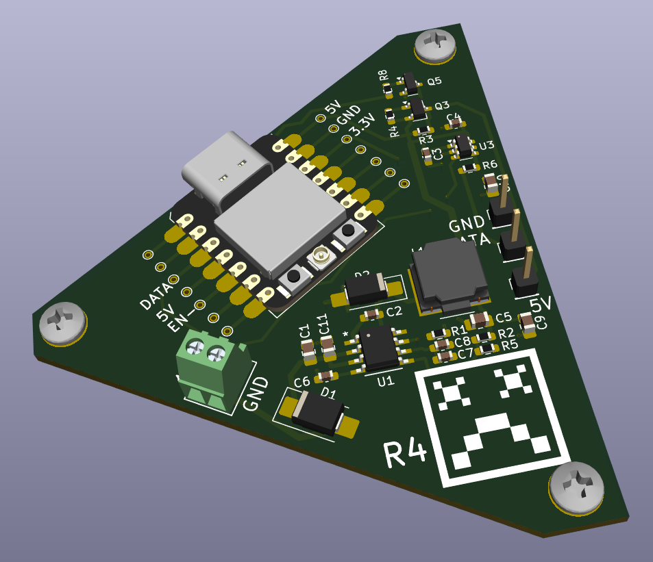

# Ray's Retirement Nest Egg Calculator

 

## Overview
Drew bought an old ambulance to fix up into an RV. I wanted to contribute so I created an ESP32 controlled light.

The light has a ring of around 80- addressable RGBW LEDs.

The board accomodates 12V to 5V @ 3A switching supply to drive the LEDs using the TPS54331DDAR.

The ESP32 is programmed with WLED. 10 of these are controlled by Home Assistant.

